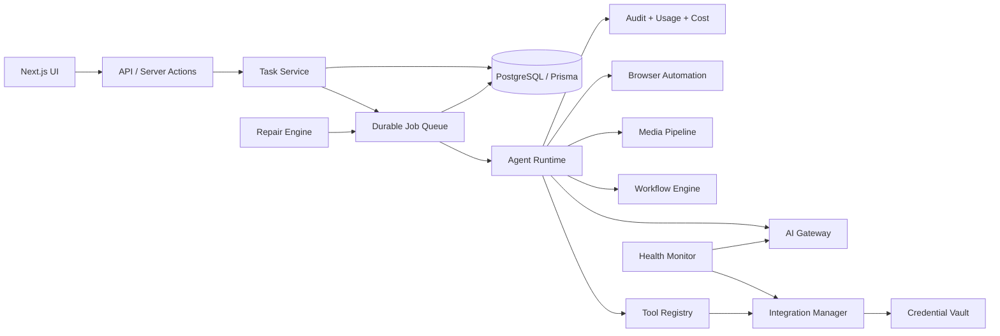

# TROS Target Architecture

## Scope

TROS (Reality Operation System) is currently a Next.js 14 application using the App Router and Pages Router, Prisma 6, PostgreSQL/Neon, NextAuth credentials, and optional external services. This document defines the target architecture without replacing existing product modules.

## Current boundary

The current application has feature pages and API routes that write directly to Prisma. AI calls are made directly from routes through `@ai-sdk/gateway`; workflow execution is delegated to Activepieces when configured; social publishing is delegated to a webhook. There is no durable task queue, unified execution log, provider registry, or resumable agent runtime yet.

## Target service topology



## Core services

- **AI Gateway:** Provider-neutral model selection, timeout/retry policy, structured output, usage/cost recording, and fallback policy.
- **Agent Runtime:** Resumable state machine for agent sessions and tasks. Every task has an execution ID, idempotency key, step state, retry count, cancellation state, and durable output.
- **Tool Registry:** Versioned, permission-checked tools with JSON schemas, side-effect classification, timeout, and audit metadata.
- **Provider Registry:** AI and external provider metadata, model capabilities, health, limits, and adapter selection.
- **Credential Vault:** Server-only encrypted credential storage. Encryption key is environment-managed; plaintext is never returned to clients or logs.
- **Task/Job Queue:** Durable Postgres-backed jobs initially; a dedicated queue such as BullMQ or a managed queue can be introduced when throughput requires it. Claiming must use leases and idempotency.
- **Scheduler:** Creates jobs from schedules, records last/next execution, and prevents overlapping runs unless explicitly allowed.
- **Workflow Engine:** Owns workflow definitions, versions, runs, step transitions, retries, and external execution adapters including Activepieces.
- **Integration Manager:** Connection lifecycle, OAuth/token handling, health checks, capabilities, rate limits, and provider-specific adapters.
- **Media Pipeline:** Durable media jobs and artifacts for image/video generation, storage, transformation, moderation, and delivery.
- **Browser Automation Layer:** Isolated browser jobs with encrypted session state, explicit user authorization, bounded runtime, and artifact capture.
- **Audit Log:** Append-only actor/action/resource/event records for security and operational review.
- **Usage/Cost Tracker:** Provider, model, request, token, latency, currency, estimated cost, and billing attribution.
- **Health Monitoring:** Connection and provider probes with status history, latency, error category, and remediation state.
- **Feature Registry:** Feature availability, rollout state, required integrations, health, and permissions.
- **Permission/RBAC:** User, role, feature, tool, and resource-scoped authorization. Backend checks are authoritative.
- **Test Lab:** Safe provider probes, workflow dry-runs, test tasks, and persisted test results isolated from production side effects.
- **Recovery/Repair Engine:** Retryable failure classification, repair attempts, operator approval gates, and recovery audit events.

## Example request lifecycle

For “Build me a website for a Nigerian real estate company”:

1. API authenticates the user and validates the request.
2. A `Task` and initial `TaskStep` are created transactionally with an execution ID.
3. A durable job is enqueued and the API returns the task ID immediately.
4. The Agent Runtime claims the job, selects tools through the registry, and records each call.
5. AI calls pass through the AI Gateway, which records provider/model/usage/cost/latency/error data.
6. WebsiteBuilderAdapter creates or updates a project through a versioned project service.
7. Progress events are persisted and streamed through polling or SSE; reconnecting clients resume from the last event ID.
8. Outputs, project version, snapshots, and final status are committed transactionally.
9. Failures become resumable steps with retry metadata and a repair attempt rather than lost request state.

## Adapter contracts

All provider boundaries live under a service layer. Pages and route handlers depend on use cases, not provider SDKs.

```ts
interface ProviderAdapter {
  health(): Promise<HealthResult>
  capabilities(): Promise<CapabilitySet>
  execute(input: unknown, context: ExecutionContext): Promise<AdapterResult>
  usage?(result: AdapterResult): UsageRecord
}

type AIProviderAdapter = ProviderAdapter & {
  execute(input: AIRequest, context: ExecutionContext): Promise<AIResult>
}
```

Concrete adapters include `WebsiteBuilderAdapter`, `ImageGenerationAdapter`, `VideoGenerationAdapter`, `SocialPlatformAdapter`, `EmailProviderAdapter`, `WorkflowProviderAdapter`, and `SearchProviderAdapter`.

## Data and consistency rules

- PostgreSQL is the system of record; external IDs are supplementary.
- Every asynchronous operation is durable and resumable.
- Every side effect requires an idempotency key and an audit event.
- Credentials are encrypted at rest and redacted at boundaries.
- User ownership and permission checks happen in the service layer, not only in UI guards.
- Existing entities remain intact; new foundation relations are additive.
